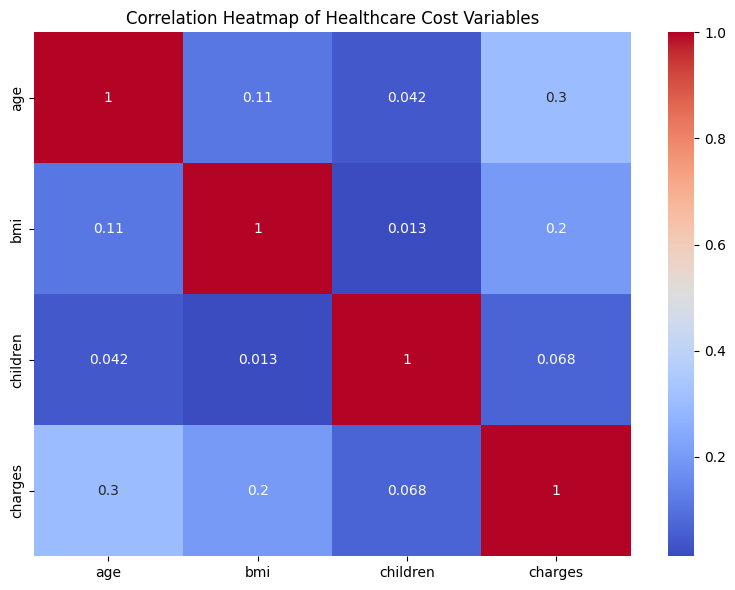
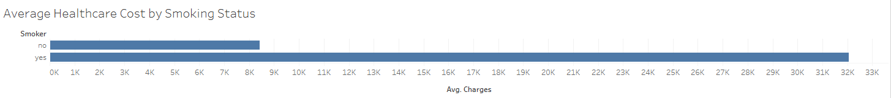
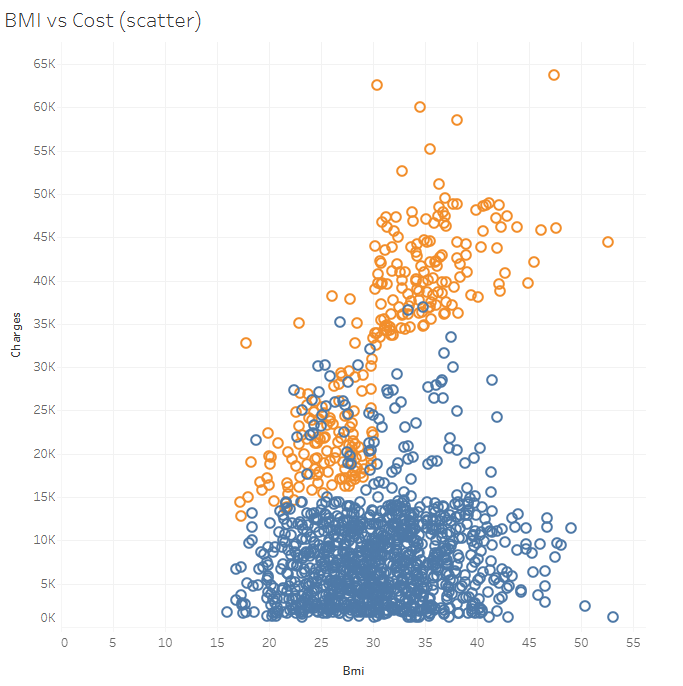
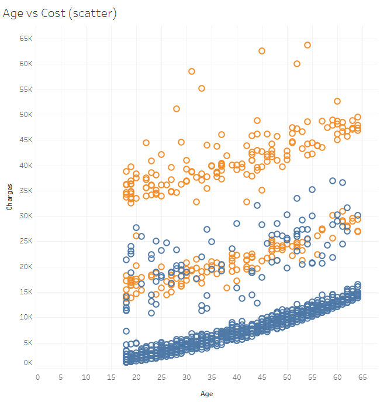
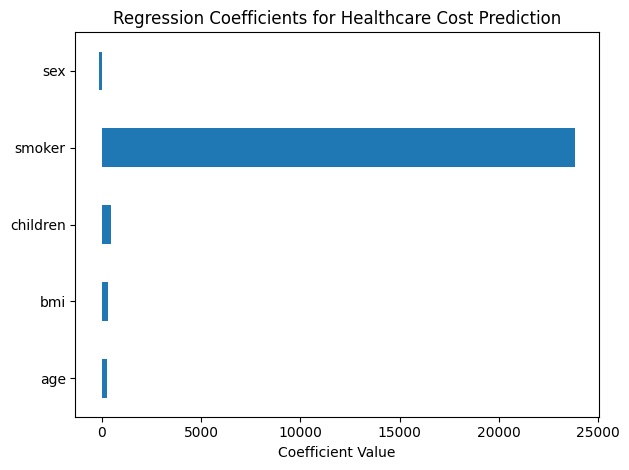
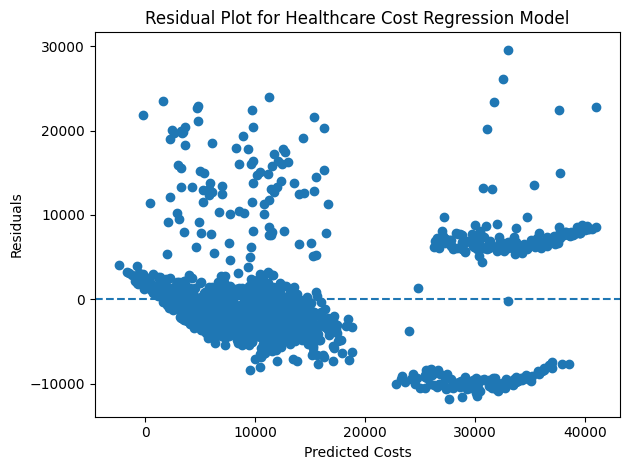

# Healthcare Cost Analysis

## Project Overview

This project analyzes a healthcare insurance dataset to identify the key factors that influence medical costs. The analysis combines exploratory data analysis, statistical modeling, and data visualization to understand how demographic and lifestyle variables affect healthcare expenses.

The goal of the project is to determine which variables most strongly predict healthcare costs and to compare different modeling approaches.

---

## Dataset

**Source:** Kaggle Medical Cost Personal Dataset

The dataset includes the following variables:

| Variable | Description |
|---|---|
| age | Age of the individual |
| sex | Gender |
| bmi | Body Mass Index |
| children | Number of dependents |
| smoker | Smoking status |
| region | Geographic region |
| charges | Individual healthcare costs |

---

## Tools Used

- Python
- Pandas
- Scikit-learn
- Matplotlib
- Seaborn
- Tableau

---

## Exploratory Data Analysis

Several visualizations were created to explore the relationships between variables and healthcare costs.

### Key insights:
- Smoking status has the strongest relationship with healthcare costs.
- Age is associated with higher medical expenses.
- BMI shows a positive relationship with healthcare charges.
- Region and sex appear to have less influence on overall cost.

### Example Visuals

#### Correlation Heatmap

#### Average Healthcare Cost by Smoking Status

#### BMI vs Healthcare Cost

#### Age vs Healthcare Cost

#### Average Healthcare Cost by Region

#### Distribution of Healthcare Costs

---

## Predictive Modeling

Two modeling approaches were used in this project:

### 1. Linear Regression

A linear regression model was used to estimate healthcare costs based on demographic and lifestyle variables.

#### Regression insights:
- Smoking status had the largest effect on predicted healthcare costs.
- Age and BMI were also meaningful predictors.
- Children had a smaller effect.
- Sex and region contributed less to the model.

#### Regression Coefficient Plot

#### Residual Plot

---

### 2. Decision Tree Model

A decision tree model was used to capture nonlinear relationships and evaluate feature importance.

#### Decision Tree insights:
- Smoking status was the most important predictor.
- Age and BMI also played strong roles in cost prediction.
- The model helped visualize how different variables interact.

#### Feature Importance

---

## Tableau Dashboard

A Tableau dashboard was created to visualize the major drivers of healthcare costs.

The dashboard includes:
- Average healthcare cost by smoking status
- BMI vs healthcare cost scatter plot
- Age vs healthcare cost scatter plot
- Average healthcare cost by region
- Distribution of healthcare costs

---

## Key Findings

The strongest driver of healthcare cost is **smoking status**. Smokers have significantly higher medical expenses than non-smokers. **Age** and **BMI** also contribute to increased healthcare costs, while **region** and **sex** have relatively limited predictive value.
